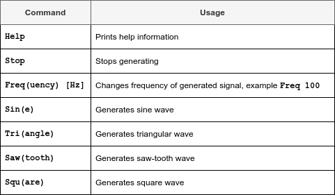

# 🎛️ SignalGenie: Your Ultimate Signal Generator!  

SignalGenie is a versatile signal generator designed to make waveforms *at your command*. Whether you need a sine wave, triangle, square, or sawtooth signal, SignalGenie has you covered. Control everything effortlessly through a UART terminal, and watch the magic happen on a graphical LCD!  

---

## 🌟 Key Features
- Generate **waveforms**:
  - 🌀 Sine
  - 📐 Triangle  
  - 📦 Square  
  - 🏔️ Sawtooth
- Adjust frequency in real-time (in Hz).  
- Start or stop waveform generation with ease.  
- **User-friendly UART interface** for commands.  
- **Graphical LCD visualization** to monitor the generated signals.  

---

## 🛠️ How It Works  

1. **Command Your Signal**  
   Use the UART terminal as your control panel. Send commands to choose waveform types, adjust frequency, and toggle generation.  

2. **Precise Signal Output**  
   The DAC peripheral on the LPC2138 microcontroller handles the generation of accurate waveforms.  

3. **Visual Feedback**  
   See the waveform in action on a GLCD for real-time monitoring.  

---

## 🖥️ System Overview  

SignalGenie runs on the **LPC2138 microcontroller**, powered by **ARM7TDMI**, and uses **FreeRTOS** for multitasking. The entire project was written in **C** using the **Keil uVision 4 IDE** and simulated in **Proteus 7.8**.

### 📜 Software Architecture  

### 📊 Control Flow  

### 📓 Command Diagram  

---

## 🧑‍🤝‍🧑 Meet the Team  

This project wouldn’t have been possible without the amazing teamwork of:  
- **Ahmed El Wakad**: GLCD Graphics and plotting Guru  
- **Elsherif Adel**: UART Driver Wizard  
- **Mahmoud Gamal**: Signal Generation Specialist
- **Karim M. Ali**: Project Architect & Terminal Master

---

## 💻 Technical Highlights  

- **Language**: C  
- **RTOS**: FreeRTOS  
- **Controller**: LPC2138 (ARM7TDMI)  
- **Development Tools**: Keil uVision 4, Proteus 7.8  

---

## 📚 About the Project  

SignalGenie was developed as a course project for the **Embedded Systems** program in Computer Engineering. It’s a testament to practical learning, teamwork, and engineering creativity.  

---

Feel free to explore the code, simulate it, and learn along the way! 🚀  
